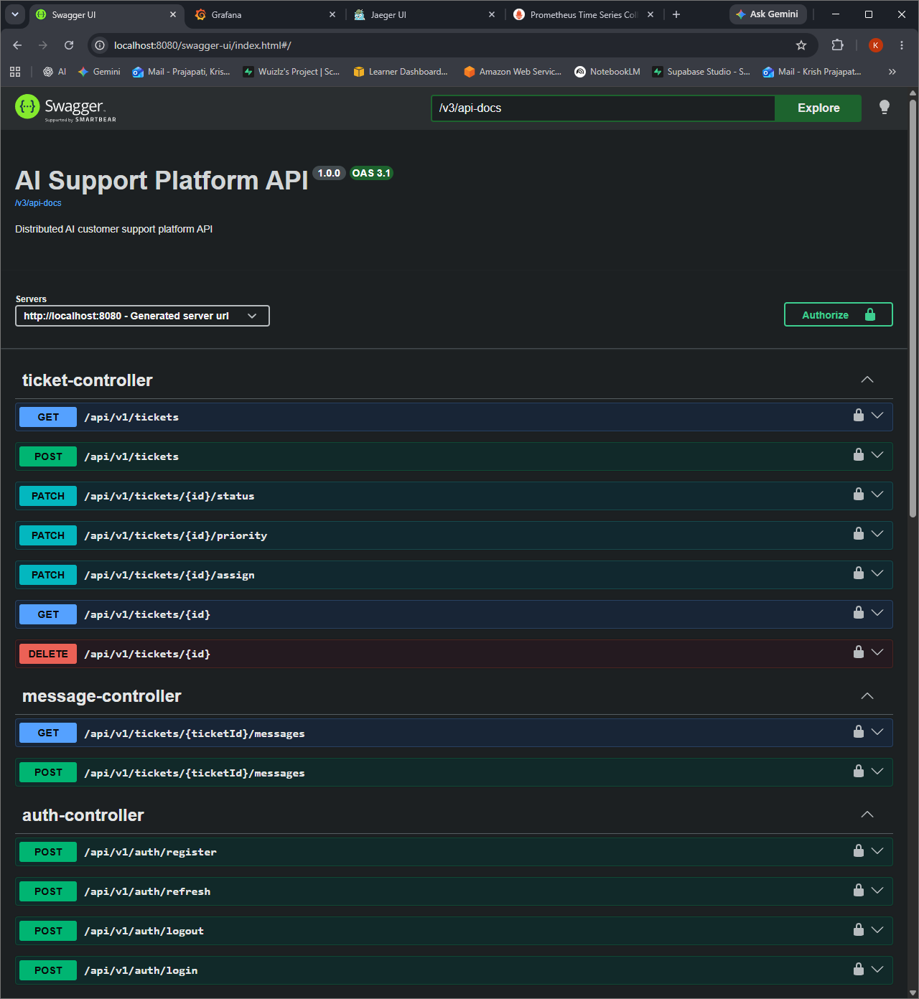
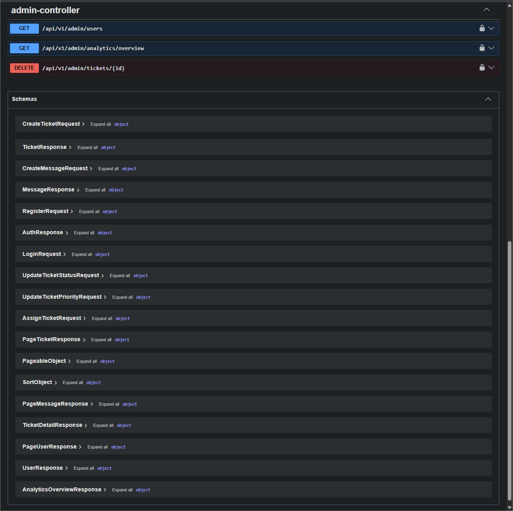
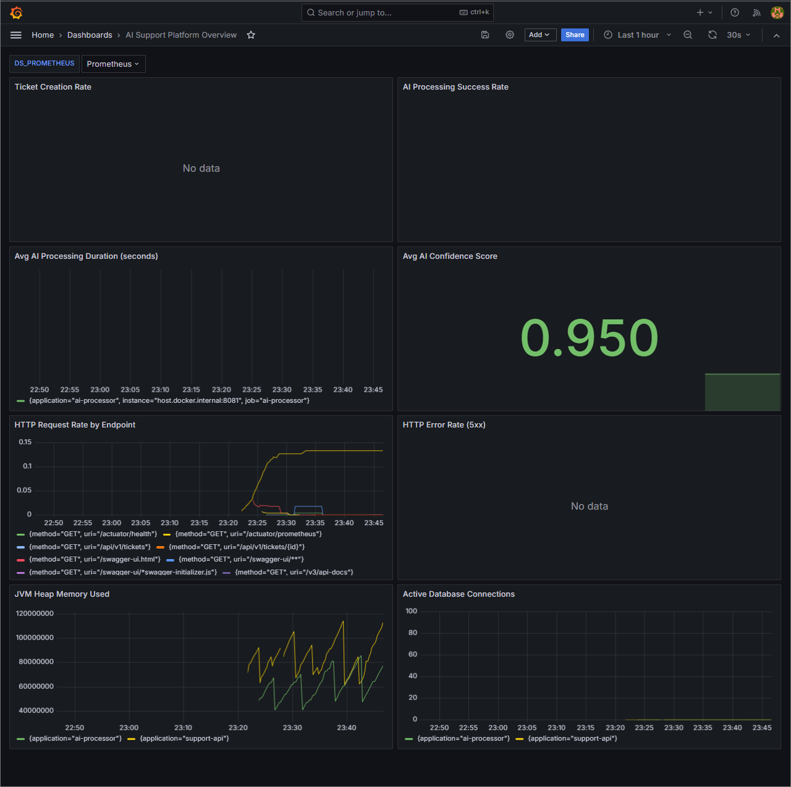
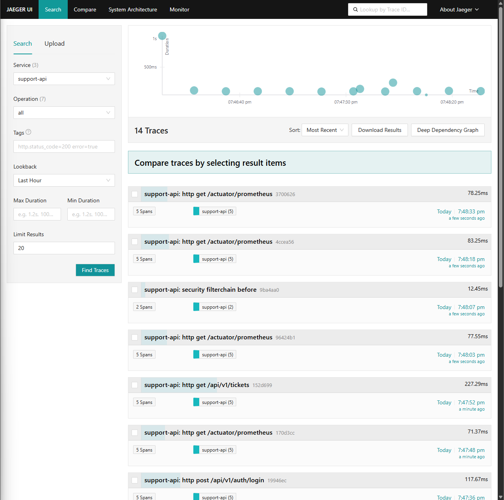
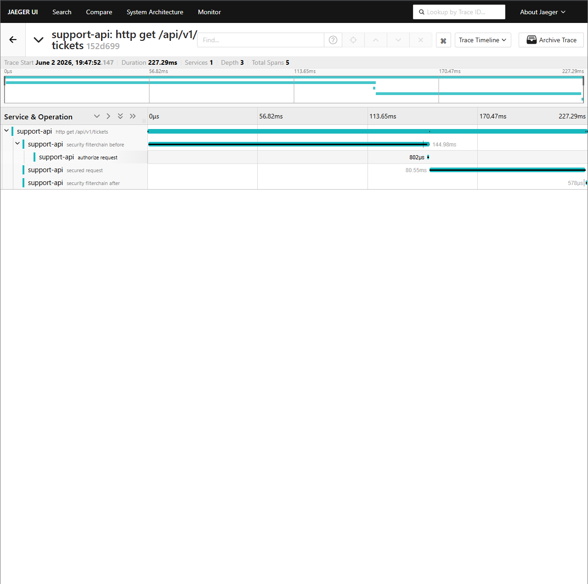
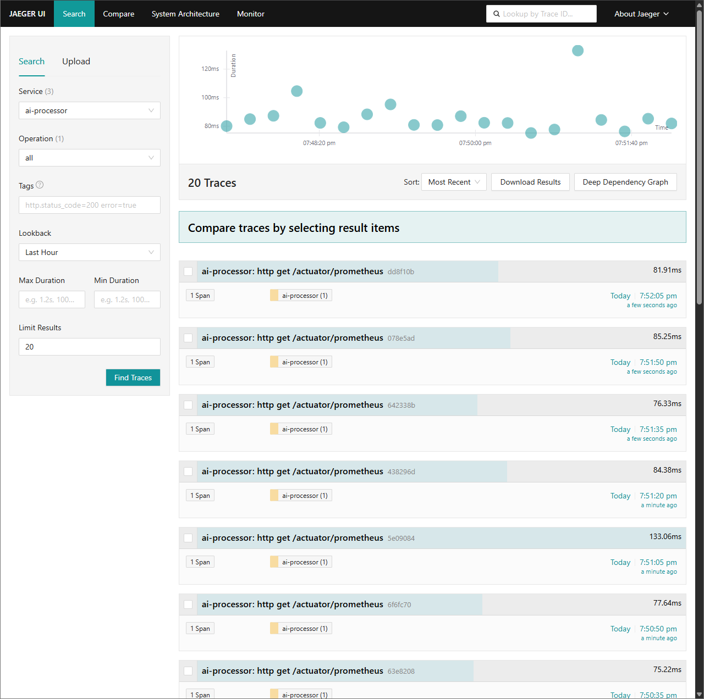

# AI Support Platform

> A distributed AI-powered customer support platform built with Spring Boot microservices, Apache Kafka, and OpenAI

[](https://openjdk.org/projects/jdk/21/)
[](https://spring.io/projects/spring-boot)
[](https://kafka.apache.org/)
[](https://www.postgresql.org/)
[](https://www.docker.com/)
[](https://github.com/features/actions)

---

## Architecture Overview

When a customer submits a support ticket, `support-api` persists it to PostgreSQL and publishes a `ticket.created` event to Kafka. `ai-processor` consumes that event, calls OpenAI GPT-4o-mini to classify the ticket (category, confidence score, escalation flag), and publishes a `ticket.processed` event back. `support-api` then consumes that result and updates the ticket status and AI metadata. Both services emit OpenTelemetry traces and Micrometer metrics, collected by a shared observability stack. All communication between microservices is asynchronous — no direct HTTP calls between services.

```
  Customer → REST API → support-api [:8080]
                              │
                  ┌───────────┴───────────┐
                  │                       │
             PostgreSQL               Kafka
              + Redis             (ticket.created)
                  │                       │
                  │              ai-processor [:8081]
                  │                       │
                  │                 OpenAI API
                  │                       │
                  └───────────┬───────────┘
                              │
                           Kafka
                     (ticket.processed)
                              │
                   Observability Stack
            (Prometheus + Grafana + Jaeger)
```

---

## Tech Stack

| Category | Technology | Purpose |
|----------|------------|---------|
| Language | Java 21 | Virtual threads, records, pattern matching |
| Framework | Spring Boot 3.5 | Auto-configuration, production-ready |
| Security | Spring Security 6 + JWT | Stateless authentication |
| Messaging | Apache Kafka | Async event-driven communication |
| Database | PostgreSQL 16 | Primary data store with Liquibase migrations |
| Cache | Redis 7.2 | Token blacklisting, analytics caching |
| AI | OpenAI GPT-4o-mini | Ticket classification and escalation |
| Tracing | OpenTelemetry + Jaeger | Distributed trace correlation |
| Metrics | Micrometer + Prometheus | Custom business metrics |
| Dashboards | Grafana | Real-time operational monitoring |
| Testing | JUnit 5 + Testcontainers | 73 tests, 80% coverage enforced |
| CI/CD | GitHub Actions + Docker | Automated test, build, deploy pipeline |
| Deployment | Oracle Cloud (ARM) | Always-free 4 OCPU 24GB production VM |

---

## Key Features

- **JWT Authentication** with refresh token rotation and Redis-backed token blacklisting — access tokens expire in 15 minutes, refresh tokens in 7 days
- **Event-driven AI processing** — tickets classified asynchronously via Kafka; `support-api` is never blocked waiting for OpenAI
- **OpenAI integration** with configurable retry logic (3 retries, 30s timeout, temperature 0.3), confidence scoring stored on every ticket, and a full audit trail via `AiResponseAudit`
- **Distributed tracing** — trace IDs propagated across both microservices via OTel with 100% sampling; correlate a ticket creation request all the way through AI processing in Jaeger
- **Structured JSON logging** — every log line includes `traceId`, `spanId`, `requestId`, `method`, and `path` fields for machine-readable log correlation
- **Custom Micrometer metrics** — `tickets.created.total`, `ticket.creation.duration`, `users.registered.total`, `users.login.total` (tagged by success/failure)
- **Role-based access control** — `CUSTOMER`, `AGENT`, and `ADMIN` roles enforced at the Spring Security level
- **Database migrations via Liquibase** — versioned schema management with a full changelog history; `ddl-auto: validate` in production
- **73 automated tests** — unit tests with Mockito, integration tests with real Postgres via Testcontainers, Kafka consumer tests with EmbeddedKafka
- **JaCoCo coverage enforcement** — `mvn verify` fails if service-layer line coverage drops below 80%
- **Dead letter queue (DLT) with retry logic** — Kafka consumer retries 3 times with 1-second backoff before sending failed events to the DLT, preventing message loss
- **Production Docker Compose** with health checks, `restart: unless-stopped`, and non-root container users

---

## Project Structure

```
ai-support-platform/
├── support-api/            # Customer-facing REST API (port 8080)
├── ai-processor/           # AI processing microservice (port 8081)
├── docker-compose.yml      # Local development infrastructure
├── docker-compose.prod.yml # Production deployment
├── prometheus/             # Prometheus configuration and alert rules
├── grafana/                # Grafana dashboards and provisioning
├── otel-collector/         # OpenTelemetry collector config
└── .github/workflows/      # CI/CD pipelines
```

---

## Getting Started

### Prerequisites

- Java 21
- Docker Desktop
- Maven 3.9+

### Local Development Setup

```bash
# 1. Clone the repository
git clone https://github.com/kishnahai0806/AI-Support-Platform.git
cd AI-Support-Platform

# 2. Create your local environment file
cp .env.example .env
# Edit .env and fill in your values:
# - JWT_SECRET: any 32+ character string for local dev
# - OPENAI_API_KEY: your OpenAI API key
# - All other values can stay as the defaults in .env.example

# 3. Create the local database (first time only)
# Option A: if using Docker PostgreSQL
docker compose up -d postgres redis zookeeper kafka
docker exec -it support-postgres psql -U postgres -c "CREATE DATABASE support_db;"

# Option B: if using local PostgreSQL installation
psql -U postgres -c "CREATE DATABASE support_db;"

# 4. Start all infrastructure
docker compose up -d

# 5. Run support-api (in a new terminal)
cd support-api
./mvnw spring-boot:run -Dspring-boot.run.profiles=local   # Mac/Linux
mvnw.cmd spring-boot:run -Dspring-boot.run.profiles=local  # Windows

# 6. Run ai-processor (in a new terminal)
cd ai-processor
./mvnw spring-boot:run -Dspring-boot.run.profiles=local   # Mac/Linux
mvnw.cmd spring-boot:run -Dspring-boot.run.profiles=local  # Windows
```

### Windows Convenience Script

A PowerShell script template is provided to start both services automatically:

```powershell
# Copy the example script
cp run-local.example.ps1 run-local.ps1

# Open run-local.ps1 and fill in your values:
# - JWT_SECRET: any 32+ character string
# - OPENAI_API_KEY: your real OpenAI key

# Run it — opens both services in separate terminal windows
.\run-local.ps1
```

> `run-local.ps1` is gitignored — your secrets never leave your machine.

Once running, access the services at:

| Service | URL | Credentials |
|---------|-----|-------------|
| Swagger UI | http://localhost:8080/swagger-ui/index.html | — |
| Grafana | http://localhost:3000 | admin / admin |
| Jaeger | http://localhost:16686 | — |
| Prometheus | http://localhost:9090 | — |

> **Note:** Integration tests use Testcontainers and require Docker to be running.
> If you have a local PostgreSQL installation running on port 5432, it may conflict
> with the Docker PostgreSQL container. Either stop the local installation or create
> the support_db database in your local PostgreSQL.

### Running Tests

```bash
# support-api — runs all tests and enforces 80% service-layer coverage
cd support-api
./mvnw verify        # Mac/Linux
mvnw.cmd verify      # Windows

# ai-processor
cd ai-processor
./mvnw verify        # Mac/Linux
mvnw.cmd verify      # Windows
```

---

## API Endpoints

| Method | Endpoint | Auth | Description |
|--------|----------|------|-------------|
| `POST` | `/api/v1/auth/register` | None | Register new user |
| `POST` | `/api/v1/auth/login` | None | Login and get JWT |
| `POST` | `/api/v1/auth/refresh` | Bearer | Refresh access token |
| `POST` | `/api/v1/tickets` | CUSTOMER | Create support ticket |
| `GET` | `/api/v1/tickets` | Any | List tickets (role-filtered) |
| `GET` | `/api/v1/tickets/{id}` | Any | Get ticket details |
| `PATCH` | `/api/v1/tickets/{id}/status` | AGENT/ADMIN | Update ticket status |
| `PATCH` | `/api/v1/tickets/{id}/assign` | AGENT/ADMIN | Assign to agent |
| `POST` | `/api/v1/tickets/{id}/messages` | Any | Send message |
| `GET` | `/api/v1/admin/analytics/overview` | ADMIN | Get analytics |
| `GET` | `/api/v1/admin/users` | ADMIN | List all users |

Full interactive documentation is available at `/swagger-ui.html` when the service is running.

---

## Environment Variables

| Variable | Description | Example |
|----------|-------------|---------|
| `SPRING_DATASOURCE_URL` | PostgreSQL connection URL | `jdbc:postgresql://localhost:5432/support_db` |
| `SPRING_DATASOURCE_PASSWORD` | Database password | `your-password` |
| `JWT_SECRET` | JWT signing secret (minimum 32 characters) | `your-32-char-secret-key` |
| `JWT_ACCESS_EXPIRY_MS` | Access token lifetime in milliseconds | `900000` (15 min) |
| `JWT_REFRESH_EXPIRY_MS` | Refresh token lifetime in milliseconds | `604800000` (7 days) |
| `OPENAI_API_KEY` | OpenAI API key | `sk-...` |
| `KAFKA_BOOTSTRAP_SERVERS` | Kafka broker address | `localhost:9092` |
| `OTEL_EXPORTER_OTLP_ENDPOINT` | OpenTelemetry collector endpoint | `http://localhost:4317` |

For production, all secrets are stored as GitHub Actions repository secrets and injected at deploy time.

---

## CI/CD Pipeline

Each microservice has an independent GitHub Actions workflow triggered by changes to its own source directory or workflow file. Workflows can also be triggered manually via `workflow_dispatch`.

```
push / PR to main
        │
        ▼
  ┌─────────────┐
  │  Job 1      │  Runs all tests against real Postgres 16 and
  │    test     │  Redis 7.2 (GitHub Actions services containers).
  └──────┬──────┘  EmbeddedKafka used for Kafka consumer tests.
         │ needs
         ▼
  ┌─────────────┐
  │  Job 2      │  Builds multi-stage Docker image (JDK build
  │ build-push  │  → JRE runtime, non-root user). Pushes to
  └──────┬──────┘  GitHub Container Registry (GHCR).
         │ needs   Only runs on push to main (not PRs).
         ▼
  ┌─────────────┐
  │  Job 3      │  SSH into Oracle Cloud VM. Pulls new image,
  │   deploy    │  restarts container via docker compose.
  └─────────────┘  Requires ORACLE_HOST and ORACLE_SSH_KEY secrets.
```

Docker images are published to:
- `ghcr.io/<owner>/support-api:latest`
- `ghcr.io/<owner>/ai-processor:latest`

---

## Observability

Both services expose metrics, traces, and structured logs out of the box.

**Metrics** — available at `/actuator/prometheus` on each service:

| Metric | Description |
|--------|-------------|
| `tickets.created.total` | Counter tagged by `priority` and `category` |
| `ticket.creation.duration` | Timer for the full ticket creation flow |
| `users.registered.total` | Counter for new user registrations |
| `users.login.total` | Counter tagged by `success=true/false` |

**Traces** — 100% of requests are sampled and exported via OTLP to Jaeger. Trace IDs appear in every structured log line, enabling log-to-trace correlation. Access Jaeger at `http://localhost:16686`.

**Dashboards** — Grafana dashboards auto-provision from `./grafana/provisioning` on startup. Access Grafana at `http://localhost:3000`.

**Alerts** — Prometheus alerting rules are defined in `./prometheus/alerts.yml` and routed through Alertmanager on port `9093`.

---

## Screenshots

### Swagger UI — API Documentation
Interactive API documentation showing all endpoints across ticket, 
message, auth, and admin controllers with JWT bearer authentication.




### Grafana Dashboard — Real-time Metrics
Live operational dashboard showing AI confidence score (0.950), 
HTTP request rate by endpoint, JVM heap memory for both services, 
active database connections, and zero 5xx errors.



### Jaeger — Distributed Tracing
Full distributed tracing across both microservices via OpenTelemetry. 
Traces show request flow through Spring Security filter chain, 
authorization, and business logic with millisecond-level timing.




